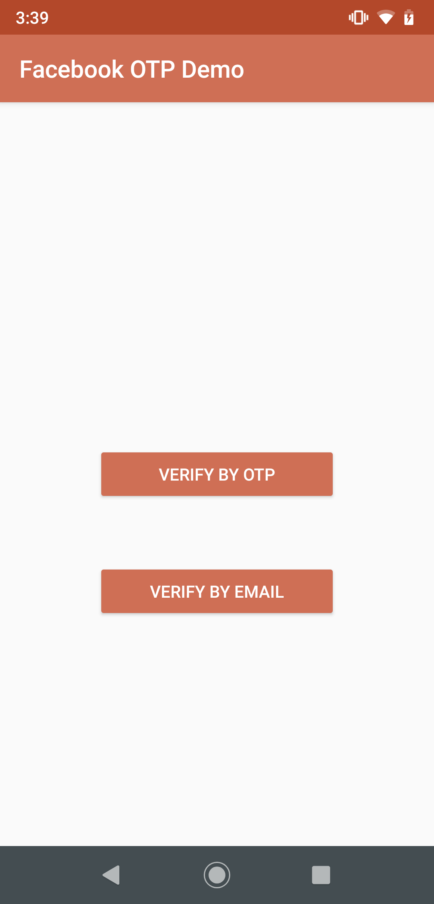
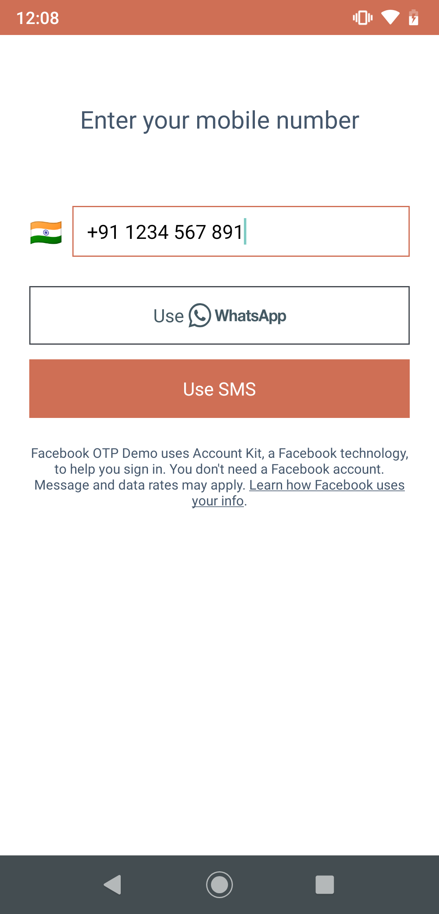
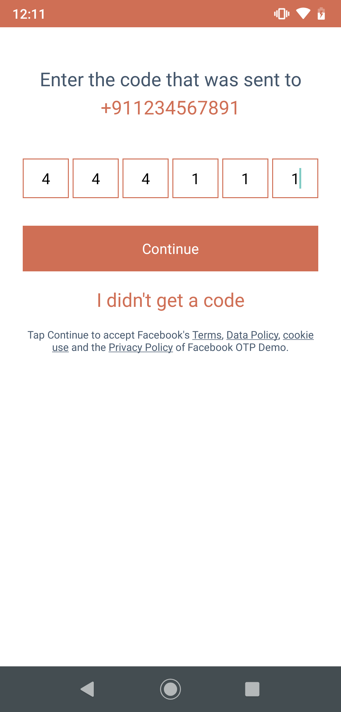

# Facebook-OTP-Demo

### Description
This demo is regarding mobile number verification with OTP and email verification using Facebook Accout KIT .

## Screenshots
| Main screen | Mobile Input | Mobile Verfication | Email Input | Email Verification
|-----------------------------------------------------------------------------------------------------------------------------|-------------------------------------------------------------------------------------------------------------------------------|----------------------------------------------------------------------------------------------------------------------|--------------------------------------------------------------------------------------------------------------------------------|--------------------------------------------------------------------------------------------------------------------------------
| |  |  |  | 

# Some Useful FAQ

**Question:** When is Account Kit being deprecated?

**Answer:** We plan to deprecate Account Kit on March 9, 2020. Note that data retrieval for apps we remove from the service will be available for 90 days after deprecation.

**Question:** Is there a charge for using SMS with Account Kit?

**Answer:** To make it easy for developers using Account Kit, we will not institute any SMS charges through August 2018. At that point, standard SMS rates may apply for apps exceeding 100,000 SMS confirmation messages per month. For FbStart apps, our program for early-stage mobile startups, we will not institute any Account Kit SMS charges indefinitely. Learn how to apply by going to the FbStart application page.

## For More FAQ
https://developers.facebook.com/docs/accountkit/faq/

## Created By

[Android Inheritx](https://github.com/android-inheritx)
